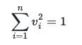

# Calculating the stationary distribution

You can calculate the limiting stationary distribution for a Markov chain by sampling.  You can also extract this vector by calculating the principle left eigenvector of the transition matrix.  NumPy provides a function for calculating the eigenvalues and eigenvectors of a matrix.  In this exercise I am thus going to show you how you can use these tools to extract the stationary distribution for a Markov chain.

The first thing to do is to set a variable called `A` equal to the transition matrix below:


using the `np.array` command that you learned about last week.

We can then calculate the eigenvalues and eigenvectors of `A` using the `np.linalg.eig` command as shown below:

```python
w, v = np.linalg.eig( A )
```

The variable `w` here is a vector that contains the eigenvalues of the matrix, while `v` is a matrix that contains the right eigenvectors.  If you print the eigenvalues (`w`) you should see that there is one eigenvalue that is equal to 1.  All the other eigenvalues will be less than 1.  If you now print the eigenvector that corresponds to the eigenvalue that has eigenvalue 1 you should see that all its elements are the same as is illustrated in the code cell below:

```python
# Print the eigenvalues
print(w)    # This outputs [ 1.   0.1 -0.1] notice that element 0 of this vector of eigenvalues is 1.
# Now print the eigenvector that corresponds to the eigenvalue that is equal to one
print(v[:,0])   # This outputs [-0.57735027 -0.57735027 -0.57735027]  # Notice that all the elements of this eigenvector are the same.
```

Doing the experiments above allows you to confirm that you have setup your transition matrix correctly.  If the Markov chain has a limiting stationary distribution then the largest eigenvalue of the transition matrix should be equal to one and the eigenvector that corresponds to this eigenvalue should have all its elements equal.  We have not extracted the limiting stationary distribution by doing the above, however, as to extract the limiting stationary distribution you need to extract the left eigenvectors by using the commands shown below:

```python
w, lv = np.linalg.eig( A.T )
```

The command above diagonalises the transpose of the transition matrix.  The eigenvalues of the transpose should be the same as the eigenvalues of the original matrix.  There should, therefore, still be an eigenvalue that is equal to one.  The eigenvector that corresponds to this eigenvalue contains the information about the limiting stationary distribution.   Problematically, however, the eigenvector will have been calculated so that its `n` elements satisfy:



we can resolve this problem by renormalising the eigenvector as follows:

```python
# I am assuming here that w[0]=1
stationary_distribution = lv[:,0] / sum(lv[:,0)
```

The elements of the vector `stationary_distribution` above sum to one.  The elements of this vector thus tell us the probabilities of being in the various states of the Markov chain.

Your task in this exercise is use the commands I have shown you to calculate and plot the limiting stationary distribution for the Markov chain with the transition graph that I have given you above.  You should label the states in this chain as 1, 2 and 3 and these labels should appear on the x-axis of your graph.  You should then draw a bar chart in which the heights of the bars are the elements of the stationary distribution for states 1, 2 and 3.  The label for the x-axis of your graph should be "State" and the label for the y-axis of your graph should be "Probability".

